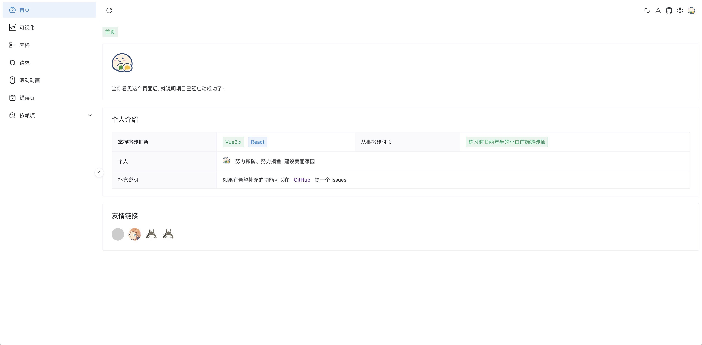

# 布局

## Layout

### 页面采用经典后台系统布局。

- 左，菜单栏（[LayoutMenu](https://github.com/XiaoDaiGua-Ray/xiaodaigua-ray.github.io/blob/main/src/layout/components/Menu/index.tsx) 源码）
- 右上，操作栏（[SiderBar](https://github.com/XiaoDaiGua-Ray/xiaodaigua-ray.github.io/tree/main/src/layout/components/SiderBar) 源码）
- 右中，标签页（[MenuTag](https://github.com/XiaoDaiGua-Ray/xiaodaigua-ray.github.io/blob/main/src/layout/components/MenuTag/index.tsx) 源码）
- 右下，页面内容

::: warning 注意
项目暂未做移动端兼容（如果后期有时间，应该会补上），但是做了对于小尺寸显示器兼容，市面常见尺寸显示器都能较好的显示。
:::
