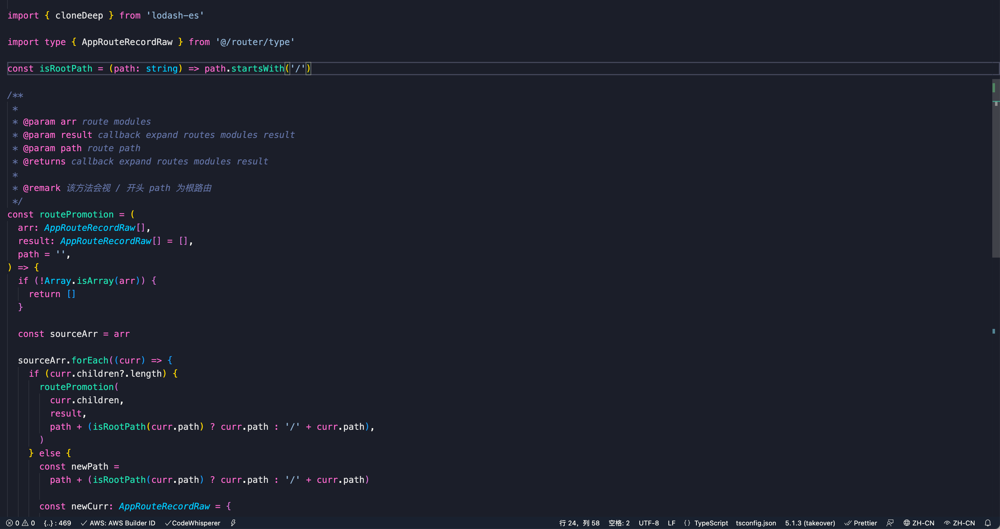

# 主题

## Sublime Material Theme

> Sublime Material Theme 是 Sublime Text 编辑器的一款热门配色方案。

- 基于 Material Design 颜色规范，色彩鲜明、大胆，使用了多种鲜艳的蓝色和粉色等颜色，使得代码在编辑器中更加美观
- 支持多种语言的高亮显示，包括 Java、Python、CSS 等常见的编程语言，让代码更加易读、易理解
- 提供了多种配套的图标和图形元素，包括文件夹图标、文件类型图标等，使得整个编辑器的界面看起来更加一致、美观
- 支持自定义配置，用户可以按照自己的喜好进行颜色、字体等方面的调整，以便更好地适应个人习惯

## Evondev Dracula

> Evondev Dracula 是一款适用于多种编辑器的主题。

- 设计简洁、清晰，使用黑色和紫色的深色调，让代码看起来更加醒目、易读
- 支持多种编辑器，包括 VS Code、Sublime Text、Atom、JetBrains 等，可以帮助用户在不同的开发环境中保持一致的体验
- 配色方案丰富，提供了多种变体，包括经典版、软色版、亮色版等，用户可以根据自己的喜好选择合适的方案
- 配套的图标和图形元素丰富，包括文件夹图标、文件类型图标等，可以让整个编辑器的界面看起来更加一致、美观

## GitHub Theme

> GitHub Theme 是一款适用于多种编辑器的主题。

- 设计简洁、清晰，使用白色和黑色的明暗对比，让代码看起来更加舒适、易读
- 支持多种编辑器，包括 VS Code、Sublime Text、Atom、JetBrains 等，可以帮助用户在不同的开发环境中保持一致的体验
- 配色方案经典，基于 GitHub 的配色方案，颜色鲜明、对比明显，让代码更加易读、易理解
- 配套的图标和图形元素丰富，包括文件夹图标、文件类型图标等，可以让整个编辑器的界面看起来更加一致、美观

## 安装步骤

- `vscode` 插件中搜索以上的主题
- 点击安装，然后按照自己喜好切换主题

## 个人推荐

:::tip 推荐
个人比较推荐德古拉（Evondev Dracula New Colour）主题，整体由粉红色、淡蓝色为主色调。
:::

## 效果

