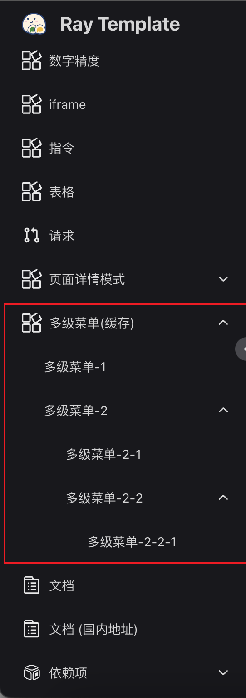

# 菜单

:::tip 注
菜单基于 `route modules`。菜单渲染结果受路由模块配置影响。
:::

## 新增菜单

> 新增路由模块后，菜单会根据新增路由模块配置自动匹配与渲染。

:::tip 注
如果路由模块含有子理由（children 长度不为零），根路由会被渲染为父级菜单项（点击不会触发路由跳转），其子路由会被渲染子级菜单项（点击会触发路由跳转）。如果通过强行修改 url 地址跳转到父级，会被错误页捕获。
:::

## 菜单结构

### 示例

```ts
import { t } from '@/locales/useI18n'
import { LAYOUT } from '@/router/constant/index'

import type { AppRouteRecordRaw } from '@/router/type'

const multiMenu: AppRouteRecordRaw = {
  path: '/multi',
  name: 'MultiMenu',
  component: LAYOUT,
  meta: {
    i18nKey: t('menu.MultiMenu'),
    icon: 'other',
    order: 4,
  },
  children: [
    {
      path: 'multi-menu-one',
      name: 'MultiMenuOne',
      component: () => import('@/views/multi/views/multi-menu-one/index'),
      meta: {
        noLocalTitle: '多级菜单-1',
        keepAlive: true,
      },
    },
    {
      path: 'multi-menu-two',
      name: 'MultiMenuTwo',
      component: LAYOUT,
      meta: {
        noLocalTitle: '多级菜单-2',
      },
      children: [
        {
          path: 'sub-menu-other',
          name: 'SubMenuOther',
          component: () =>
            import(
              '@/views/multi/views/multi-menu-two/views/sub-menu-other/index'
            ),
          meta: {
            noLocalTitle: '多级菜单-2-1',
            keepAlive: true,
          },
        },
        {
          path: 'sub-menu',
          name: 'SubMenu',
          component: LAYOUT,
          meta: {
            noLocalTitle: '多级菜单-2-2',
            keepAlive: true,
          },
          children: [
            {
              path: 'sub-menu-one',
              name: 'MultiMenuTwoOne',
              component: () =>
                import(
                  '@/views/multi/views/multi-menu-two/views/sub-menu/views/multi-menu-two-one/index'
                ),
              meta: {
                noLocalTitle: '多级菜单-2-2-1',
                keepAlive: true,
              },
            },
          ],
        },
      ],
    },
  ],
}

export default multiMenu
```

### 渲染结果


